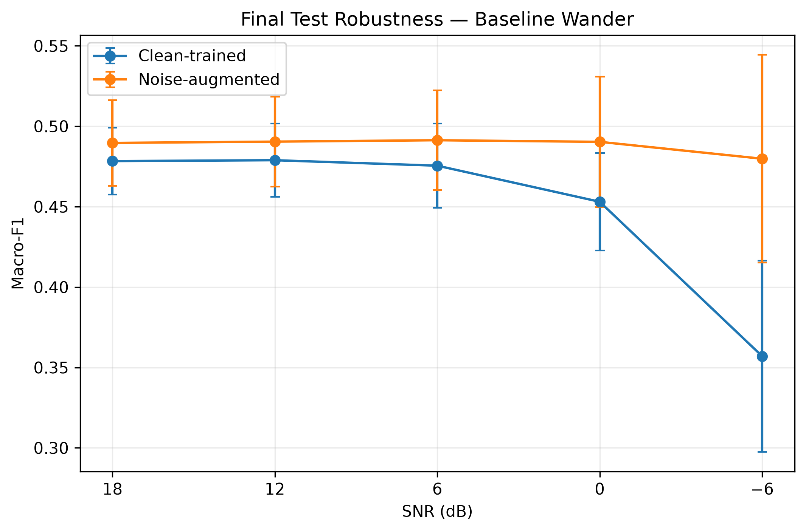
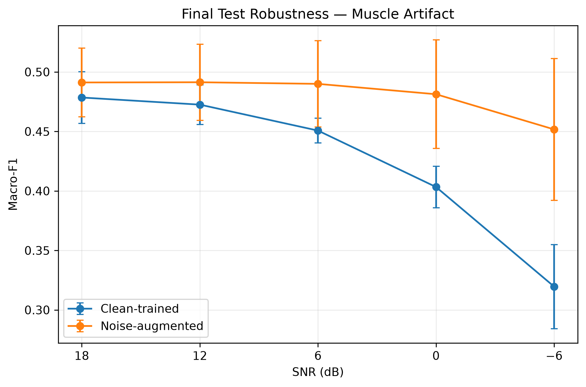
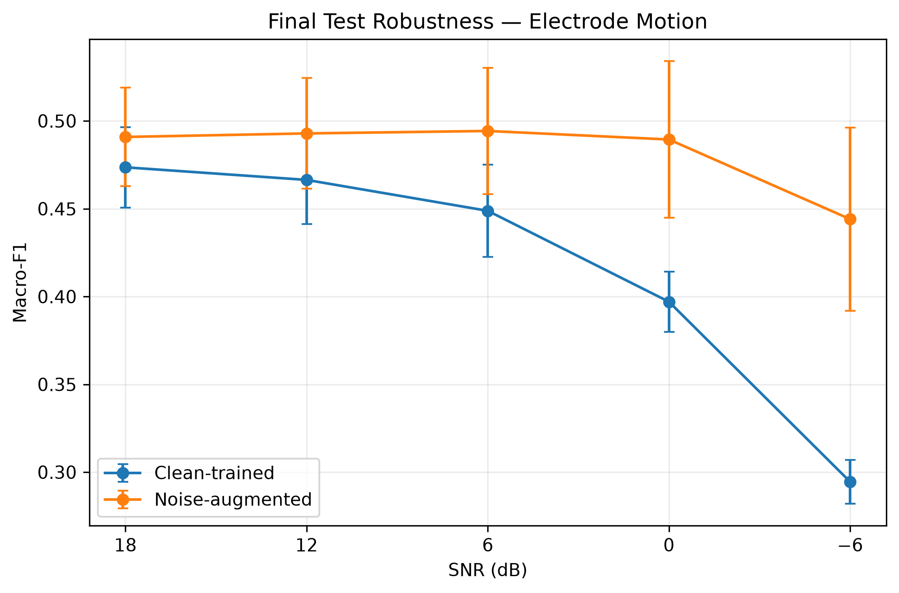
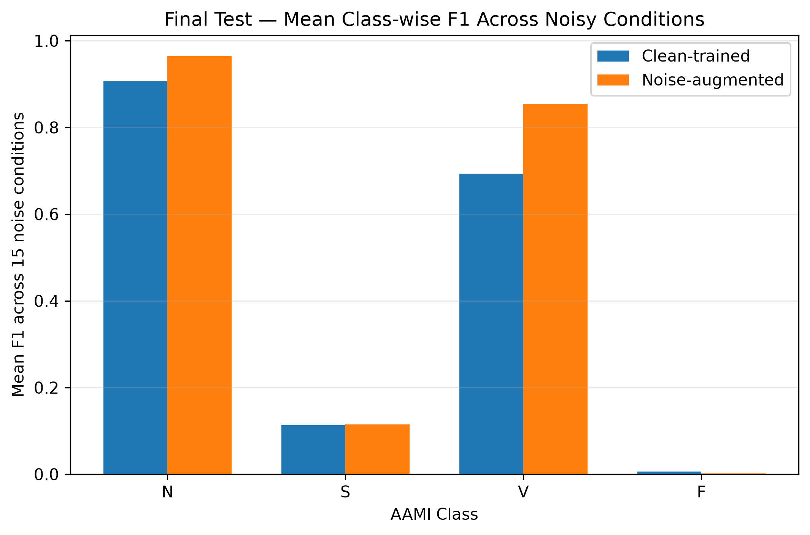
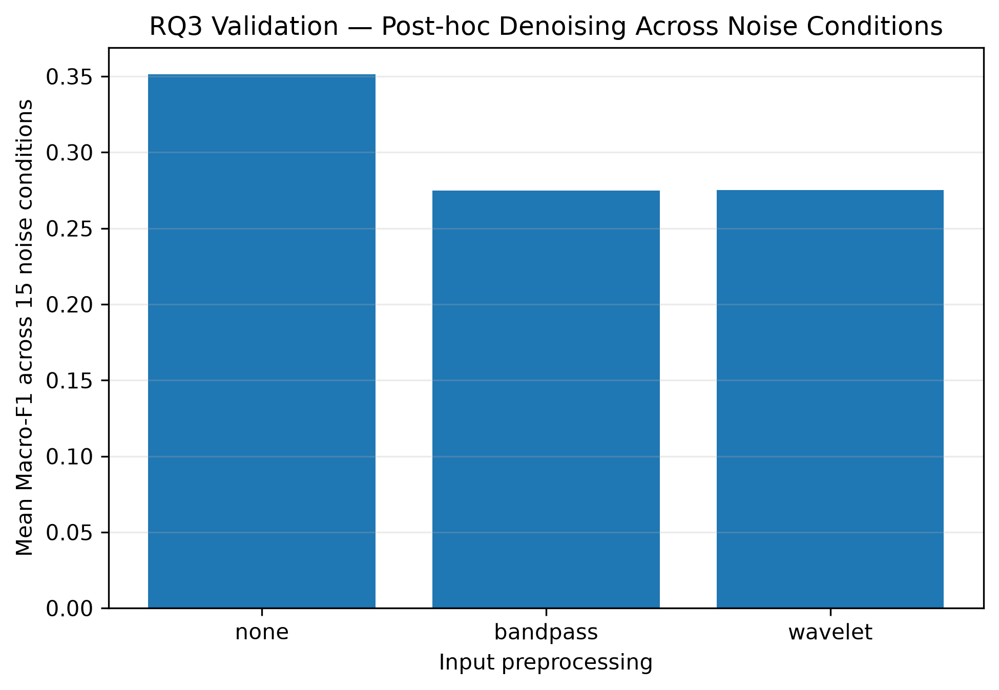

# Noise-Robust Multi-Class ECG Arrhythmia Classification

**Patient-independent ECG arrhythmia classification under realistic signal artifacts**

This research project investigates how realistic ECG artifacts affect arrhythmia classification and whether robustness can be improved through signal denoising or training-time noise augmentation.

The study focuses on **robustness methodology and controlled evaluation**, rather than architecture search.

---

## Key Result

Multi-SNR noise augmentation substantially reduced performance degradation under severe realistic ECG artifacts while preserving clean-test performance on held-out patients.

### Final Test at −6 dB

| Artifact | Clean-trained | Noise-augmented | Improvement |
|---|---:|---:|---:|
| Baseline wander | 0.3570 | **0.4798** | **+0.1228** |
| Muscle artifact | 0.3196 | **0.4517** | **+0.1321** |
| Electrode motion | 0.2945 | **0.4441** | **+0.1495** |

Approximate degradation from clean Final Test performance:

| Artifact | Clean-trained drop | Noise-augmented drop |
|---|---:|---:|
| Baseline wander | ~25% | **~2%** |
| Muscle artifact | ~33% | **~8%** |
| Electrode motion | ~38% | **~9%** |

The robustness improvement also generalized to **SNR levels not used during training**.

---

## Research Highlights

- Patient-independent evaluation on held-out ECG records
- Realistic artifacts from the MIT-BIH Noise Stress Test Database
- Controlled evaluation across multiple SNR levels
- Comparison of clean training, post-hoc denoising, and noise augmentation
- Generalization testing on unseen SNR intensities
- Three-seed reproducibility analysis
- Frozen Final Test evaluated only after development decisions were finalized
- Per-class robustness analysis
- Explicit reporting of model limitations and failure cases

---

## Research Contributions

This project makes five main experimental contributions:

1. **Patient-independent robustness evaluation**

   Evaluates ECG arrhythmia classification on records separated at the patient/record level rather than randomly splitting heartbeat samples.

2. **Artifact-specific robustness analysis**

   Quantifies the impact of baseline wander, muscle artifact, and electrode motion across controlled SNR levels.

3. **Post-hoc denoising evaluation**

   Tests whether conventional band-pass filtering or wavelet denoising can recover classifier performance without retraining.

4. **Training-time multi-SNR augmentation**

   Evaluates paired clean/noisy augmentation while keeping the underlying classifier architecture unchanged.

5. **Generalization and reproducibility analysis**

   Tests robustness across multiple random seeds, unseen SNR intensities, and an untouched held-out Final Test set.

---

# Research Questions

### RQ1

**How strongly does realistic ECG noise affect patient-independent arrhythmia classification?**

### RQ2

**Which arrhythmia classes are most vulnerable to baseline wander, muscle artifact, and electrode motion?**

### RQ3

**Can post-hoc band-pass filtering or wavelet denoising recover classification performance?**

### RQ4

**Does multi-SNR noise augmentation improve robustness, including at SNR intensities not seen during training?**

---

# Experimental Overview

```text
MIT-BIH Arrhythmia ECG
        |
        v
AAMI-style label mapping
        |
        v
Patient-independent split
        |
        v
Heartbeat segmentation + RR extraction
        |
        v
Clean baseline model
        |
        +-----------------------------+
        |                             |
        v                             v
Realistic NSTDB corruption     Post-hoc denoising
        |                             |
        v                             v
RQ1 / RQ2 robustness              RQ3
        |
        v
Paired clean/noisy
multi-SNR training
        |
        v
RQ4
        |
        v
Three-seed reproducibility
        |
        v
Frozen held-out Final Test
```

---

# Datasets

## MIT-BIH Arrhythmia Database

Used for ECG recordings, heartbeat annotations, and arrhythmia labels.

The core task uses a four-class AAMI-style grouping:

| Class | Description |
|---|---|
| **N** | Normal and bundle branch beats |
| **S** | Supraventricular ectopic beats |
| **V** | Ventricular ectopic beats |
| **F** | Fusion beats |

Paced-heavy records:

```text
102
104
107
217
```

were excluded from the core experiment.

Record `100` was used only for sanity and preprocessing checks and was excluded from Train, Validation, and Final Test.

---

## MIT-BIH Noise Stress Test Database

Used as the source of realistic ECG artifacts:

| Code | Artifact |
|---|---|
| `bw` | Baseline wander |
| `ma` | Muscle artifact |
| `em` | Electrode motion |

Noise was mixed into the **continuous ECG signal before heartbeat extraction** at controlled SNR levels.

---

# Patient-Independent Split

The project uses a modified patient-independent record split.

| Split | Records |
|---|---:|
| Train | 18 |
| Validation | 5 |
| Sanity-only | record `100` |
| Final Test | 20 held-out DS2 records |
| Paced-heavy excluded | 4 |

The Final Test set remained untouched throughout model development.

All preprocessing choices, model decisions, augmentation settings, random seeds, and evaluation conditions were frozen before Final Test evaluation.

**No model tuning or selection was performed after observing Final Test results.**

---

# Model

Each prediction combines two information sources:

## 1. ECG morphology

A **256-sample heartbeat window** centered around the annotated heartbeat.

Each heartbeat is independently normalized using a per-beat z-score.

The ECG waveform is processed by a compact **1D CNN**.

## 2. RR timing information

Four RR features are concatenated with the learned CNN representation:

- `pre_rr`
- `post_rr`
- `average_rr`
- `local_average_rr`

RR statistics are standardized using parameters fitted on the **training split only**.

### Architecture Overview

```text
256-sample ECG heartbeat
          |
          v
        1D CNN
          |
          v
ECG representation
          |
          +--------- 4 RR features
          |
          v
     Concatenation
          |
          v
      Classifier
          |
          v
       N / S / V / F
```

---

# Evaluation Metrics

The dataset is severely imbalanced.

For this reason, **Macro-F1** is used as the primary performance metric rather than overall accuracy.

Additional metrics include:

- Balanced Accuracy
- Per-class Precision
- Per-class Recall
- Per-class F1

---

# RQ1 — Effect of Realistic Noise

The clean-trained ECG + Raw RR model achieved:

**Validation Macro-F1 = 0.403**

At severe noise intensity (`−6 dB`):

| Noise | Macro-F1 |
|---|---:|
| Baseline wander | 0.336 |
| Muscle artifact | 0.277 |
| Electrode motion | 0.251 |

Approximate degradation from clean Validation:

- baseline wander: ~17%
- muscle artifact: ~31%
- electrode motion: ~38%

### Finding

Classification performance degraded substantially as SNR decreased.

Electrode motion was generally the most destructive artifact, followed by muscle artifact, while baseline wander was less severe.

---

# RQ2 — Class-Specific Vulnerability

Clean Validation performance:

| Class | F1 |
|---|---:|
| N | **0.948** |
| S | 0.053 |
| V | **0.598** |
| F | 0.014 |

The **V class** had meaningful clean classification performance but degraded strongly under realistic artifacts.

The **N class** was comparatively more stable.

The S and F classes already had weak clean performance, so conclusions about their noise vulnerability must be interpreted cautiously.

---

# RQ3 — Post-Hoc Denoising

Two denoising strategies were evaluated **without retraining the classifier**:

### Band-pass filtering

- Fourth-order Butterworth
- `0.5–40 Hz`

### Wavelet denoising

- `db4`
- level `6`
- soft thresholding

## Clean Validation Control

| Method | Macro-F1 |
|---|---:|
| No denoising | **0.403** |
| Band-pass | 0.282 |
| Wavelet | 0.271 |

Post-hoc denoising generally reduced classifier performance.

A limited exception occurred for severe muscle artifact at `−6 dB`:

| Method | Macro-F1 |
|---|---:|
| None | 0.277 |
| Band-pass | 0.296 |
| Wavelet | **0.316** |

### Finding

Improved signal appearance did **not** consistently translate into improved classifier performance.

A plausible explanation is **input distribution shift**: the classifier was trained on unfiltered heartbeat morphology, while post-hoc denoising modifies that morphology.

---

# RQ4 — Multi-SNR Noise Augmentation

A second model with the **same architecture and RR features** was trained using paired clean/noisy augmentation.

### Training artifacts

- baseline wander
- muscle artifact
- electrode motion

### Training SNR levels

```text
18 dB
6 dB
−6 dB
```

### Reserved unseen SNR levels

```text
12 dB
0 dB
```

Each augmented epoch contained the same total number of optimizer exposures as the clean baseline:

```text
50% clean
50% noisy
```

---

# Multi-Seed Reproducibility

Both final training strategies were repeated with three random seeds:

```text
42
123
2026
```

## Clean Validation

| Training strategy | Macro-F1 |
|---|---:|
| Clean-trained | **0.3847 ± 0.0192** |
| Noise-augmented | 0.3650 ± 0.0229 |

The clean-trained model was better on average on clean Validation, although the direction of the difference was seed-sensitive.

## Robustness Gains

Noise-augmented minus clean-trained Macro-F1:

| Artifact | SNR | Improvement |
|---|---:|---:|
| Muscle artifact | 0 dB | +0.014 |
| Muscle artifact | −6 dB | **+0.043** |
| Electrode motion | 0 dB | +0.021 |
| Electrode motion | −6 dB | **+0.056** |

All four improvements occurred in **3/3 seeds**.

---

# Final Held-Out Test

After all development decisions were frozen, both strategies were evaluated once on the untouched DS2 Final Test records.

## Clean Final Test

| Model | Macro-F1 |
|---|---:|
| Clean-trained | 0.4767 ± 0.0208 |
| Noise-augmented | **0.4898 ± 0.0268** |

The small difference is interpreted as **preserved clean performance**, not definitive evidence that augmentation improves clean performance.

---

# Severe-Noise Final Test

At `−6 dB`:

| Artifact | Clean-trained | Noise-augmented | Difference |
|---|---:|---:|---:|
| Baseline wander | 0.3570 | **0.4798** | +0.1228 |
| Muscle artifact | 0.3196 | **0.4517** | +0.1321 |
| Electrode motion | 0.2945 | **0.4441** | +0.1495 |

### Finding

Noise augmentation substantially reduced classifier collapse under severe realistic artifacts.

---

# Generalization to Unseen SNR Intensities

The augmentation model was also evaluated at:

```text
12 dB
0 dB
```

These SNR levels were **not used during augmentation training**.

Across these conditions:

| Model | Mean Macro-F1 |
|---|---:|
| Clean-trained | 0.4452 |
| Noise-augmented | **0.4893** |
| Difference | **+0.0441** |

The robustness benefit therefore generalized beyond the exact SNR intensities used during training.

---

# Per-Class Final Test Analysis

Across all 15 noisy Final Test conditions:

| Class | Clean-trained mean F1 | Noise-augmented mean F1 | Difference |
|---|---:|---:|---:|
| N | 0.907 | **0.964** | +0.057 |
| S | 0.113 | 0.115 | +0.002 |
| V | 0.693 | **0.854** | **+0.161** |
| F | 0.006 | 0.002 | −0.004 |

The largest robustness improvement occurred for the **V class**, followed by **N**.

### Ventricular-class F1 at −6 dB

```text
Baseline wander:   0.337 → 0.806
Muscle artifact:   0.280 → 0.701
Electrode motion:  0.292 → 0.661
```

S remained difficult and F remained essentially unresolved.

---

# Key Figures

## Robustness Under Baseline Wander



## Robustness Under Muscle Artifact



## Robustness Under Electrode Motion



## Per-Class Robustness



## Post-Hoc Denoising



---

# Main Findings

1. Realistic ECG artifacts can substantially degrade arrhythmia classification.

2. Artifact type matters: electrode motion and muscle artifact were generally more destructive than baseline wander.

3. The V class provided a particularly informative robustness case because it had useful clean performance but degraded strongly under noise.

4. Post-hoc band-pass filtering and wavelet denoising did not provide a reliable recovery strategy.

5. Multi-SNR noise augmentation substantially improved robustness under severe artifacts.

6. The major robustness gains were reproduced across multiple random seeds.

7. The robustness trend was confirmed on held-out patients.

8. Improvements generalized to SNR intensities not used during augmentation training.

---

# Limitations

## Severe Class Imbalance

The S and especially F classes have limited effective support and patient diversity.

## Weak S and F Classification

This project does not solve robust recognition of S or F beats.

Results involving these classes should therefore be interpreted cautiously.

## Limited Model Family

The study intentionally evaluates one compact 1D CNN rather than performing a broad architecture search.

The main contribution is the **robustness experiment**, not architecture optimization.

## Three-Seed Reproducibility

Three random seeds provide a useful stability check but are insufficient for strong statistical-significance claims.

## Annotated Beat Locations

The experiment assumes known beat annotations.

It evaluates classification after signal corruption and does not investigate R-peak detection failure under noise.

## Dataset Scope

The main findings are based on the MIT-BIH Arrhythmia Database with NSTDB-derived artifact corruption.

No external clinical dataset was used for independent validation.

---

# Reproducibility

## Multi-Seed Training

```bash
python -m scripts.run_multiseed_reproducibility
```

## Multi-Seed Robustness Evaluation

```bash
python -m scripts.evaluate_multiseed_rq4_robustness
```

## Final Held-Out Evaluation

Final evaluation should only be run with the already-frozen checkpoints:

```bash
python -m scripts.evaluate_final_ds2_v2
```

The Final Test must not be used for further model selection or tuning.

## Generate Final Figures and Tables

```bash
python -m scripts.generate_final_figures_tables
```

---

# Result Files

Important result tables are stored under:

```text
results/tables/
results/final_test/
```

Key outputs include:

```text
results/final_test/final_multiseed_summary.csv

results/final_test/
final_multiseed_per_class_summary.csv

results/tables/
final_test_main_table.csv

results/tables/
final_per_class_noisy_average.csv

results/tables/
rq4_multiseed_robustness_summary.csv

results/tables/
rq3_denoising_summary.csv
```

---

# Repository Structure

```text
robust-ecg-arrhythmia/
│
├── src/
│   ├── data/
│   │   ├── aami.py
│   │   ├── splits.py
│   │   ├── rr_features.py
│   │   └── noise_augmented_dataset.py
│   │
│   ├── models/
│   │   └── cnn1d_rr.py
│   │
│   ├── noise/
│   │   ├── mixing.py
│   │   └── heartbeat_pipeline.py
│   │
│   ├── signal_processing/
│   │   ├── bandpass.py
│   │   └── wavelet.py
│   │
│   └── training/
│       └── paired_clean_noisy_sampler.py
│
├── scripts/
│   ├── train_noise_augmented_rr.py
│   ├── run_multiseed_reproducibility.py
│   ├── evaluate_multiseed_rq4_robustness.py
│   ├── evaluate_final_ds2_v2.py
│   └── generate_final_figures_tables.py
│
├── results/
│   ├── figures/
│   ├── tables/
│   └── final_test/
│
└── docs/
    └── final_results_summary.md
```

---

# Project Status

**Experimental phase complete.**

The following were frozen before Final Test evaluation:

- data split
- preprocessing
- ECG representation
- RR features
- CNN architecture
- loss weighting
- noise augmentation protocol
- random seeds
- SNR evaluation levels
- model checkpoints
- Final Test results

No additional tuning should be performed using Final Test results.

---

# Short Research Summary

This project evaluates patient-independent ECG arrhythmia classification under realistic baseline-wander, muscle, and electrode-motion artifacts.

Post-hoc denoising did not reliably recover classifier performance, whereas multi-SNR noise augmentation substantially improved robustness under severe artifacts, generalized to unseen SNR intensities, and preserved clean performance on a held-out patient test set.
